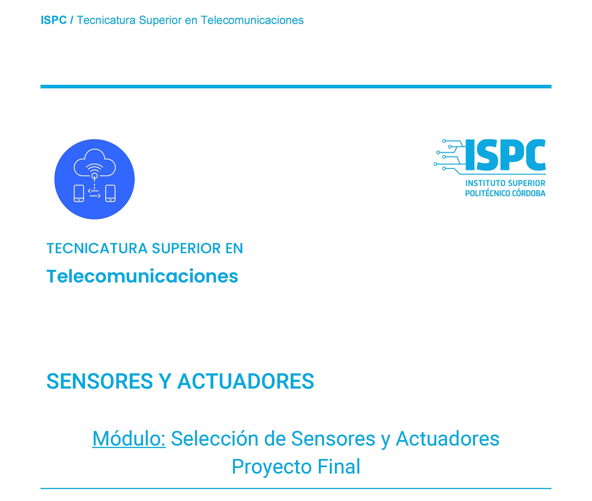

  

## Bienvenido a las prácticas de Sensores y Actuadores:  

La modalidad será la siguiente:  

Cada práctica se desarrollará en forma grupal, debiendo subir el desarrollo de la misma al repositorio (respetando la estructura de monorepositorio) establecido por grupo. Los ejercicios serán implementados de forma que a cada integrante le corresponda 1 o más tareas (issues); por lo que deberán crear el proyecto correspondiente, con la documentación asociada si hiciera falta, y asignar los issues por integrante. De esta forma quedara documentada la colaboración de cada alumno.  

## Actividad no 1
**Buscar los Datasheets de los siguientes Tipos de Sensores a usar en nuestro Proyecto loT y alojarlos en el respectivo repositorio de Git Hub:**  

**https://github.com/ISPC-TST-FP-2024/proyecto-CGRH/B_Investigación/Sprint_1/Ficha_de_datos/**  

1. Sensores de Lluvia:  

    a. Sensor de lluvia resistivo YL-83
 
    b. Sensor de lluvia capacitivo HTU31  

    c. Pluviómetro de balancín (Davis Instruments 6466)  

2. Sensores de Humedad del Suelo:  

    d. Sensor de humedad del suelo resistivo YL-69  

    e. Sensor de humedad del suelo capacitivo v1.2   

    f. [TDR-315H Sensor](./F_Sensor_TDR315H.pdf)

3. Sensores de pH:  

    g. Sensor de PH SEN0161 de DFRobot.   

    h. Atlas Scientific pH Sensor Kit  

    i. Vernier pH Sensor.   

## **Actuadores:**

4. Bombas de Agua:  

    j. Bomba peristáltica (Intllab Mini).  

    k. Bomba sumergible (Seaflo SFDP1-030-045-33). 
    
    l. Bomba de diafragma (Shurflo 2088-594-144).  

5. Electroválvulas:  

    m. Válvula Solenoide Para Agua - 12v 1/2"  

    n. Electroválvula - Pgv 1 con control de flujo - Irrigación  

    o. Válvula Rain Bird 1 100hv 24v Electroválvula Riego Jardín  

## Ejercicio n° 2:
**Realizar una investigación de Mercado y buscar y tabular los precios de los Sensores y Actuadores anteriormente listados.**  

En caso de que no se encuentren los mismos, buscar un dispositivo similar o compatible con los del listado y buscar el precio de mercado.  

El costo de los Sensores y Actuadores deben realizarlo en una tabla Excel o similar y alojarlo también en el repositorio de Git Hub, igual al anterior, pero en una carpeta llamada "Costos".  

https://github.com/ISPC-TST-FP-2024/proyecto-CGRH/B_Investigación/Sprint_1/Costos/  
    
      

      